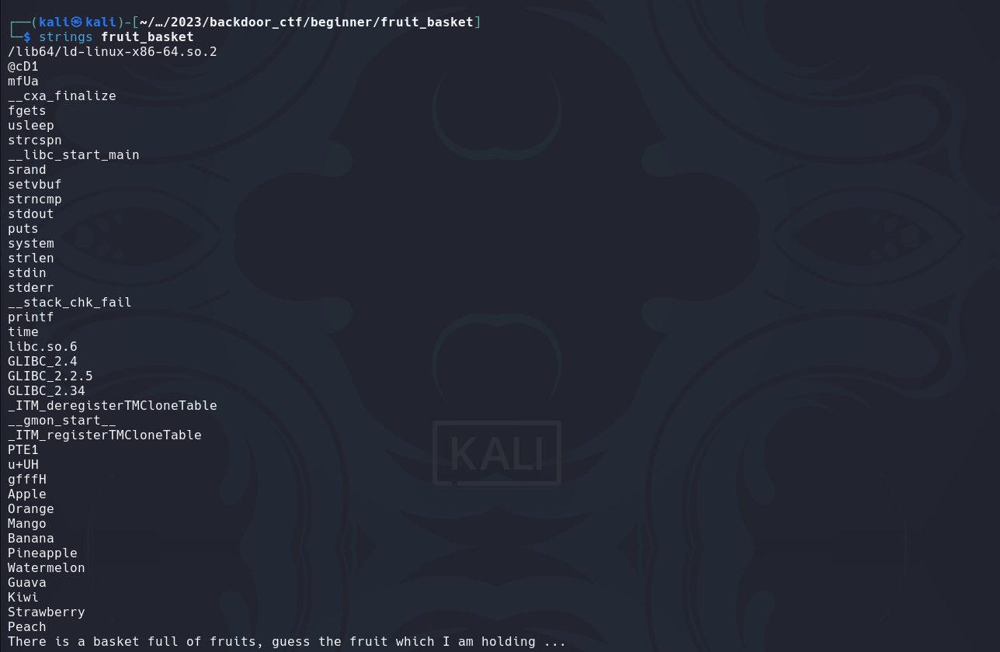
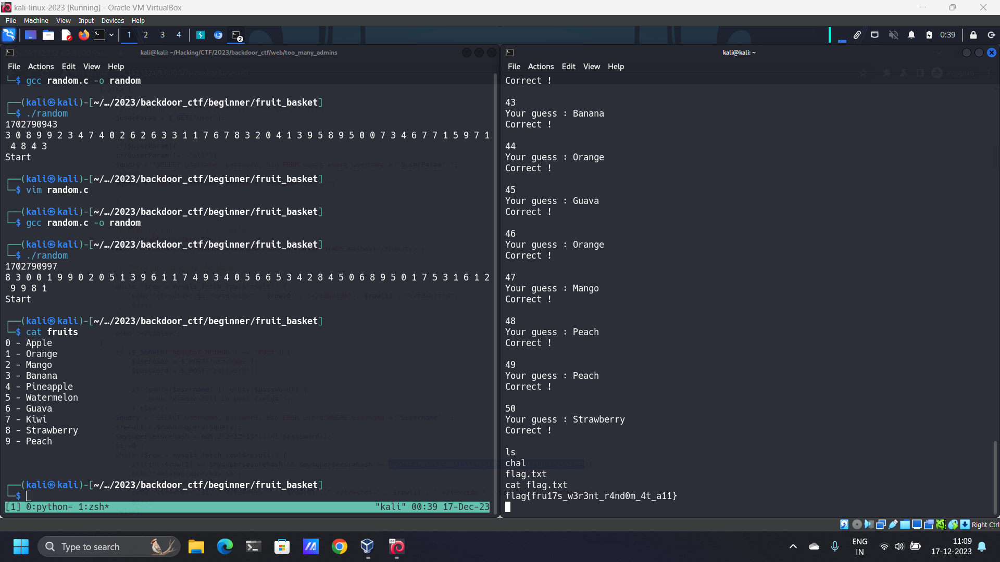

# Fruit Basket

## Challenge Description

🍎🍌🍇🍓🍊🥭🍍🍑🍈🍉

Ip address and port number of the challenge

Challenge attachments: [chal](chal)
Challenge author: P3g4su5

## Solution

We are given a single executable file for this challenge. On running it, it looks like a game where we need to guess fruits. The first thing I tried was running `strings` on this which gives us the below result.



These must be the fruits which we are supposed to guess. Next let's try analyzing this file using `Ghidra`. I just renamed the variables names a bit to make the code more readable.

```c
undefined8 main(void)

{
  int chosen_index;
  time_t tVar1;
  size_t new_line_index;
  long in_FS_OFFSET;
  int points;
  char input_fruit [12];
  long local_10;
  char *chosen_fruit;
  bool shell;
  
  local_10 = *(long *)(in_FS_OFFSET + 0x28);
  tVar1 = time((time_t *)0x0);
  srand((uint)tVar1);
  shell = true;
  puts("There is a basket full of fruits, guess the fruit which I am holding ...");
  puts(
      "This seems hard, so I will give an awesome reward, something like a shell if you guess all th e fruits right :)"
      );
  usleep(2000000);
  puts("\nThe game starts now !");
  points = 0;
  do {
    if (0x31 < points) {
LAB_001014ca:
      if (shell) {
        system("/bin/sh");
      }
      if (local_10 != *(long *)(in_FS_OFFSET + 0x28)) {
                    /* WARNING: Subroutine does not return */
        __stack_chk_fail();
      }
      return 0;
    }
    chosen_index = rand();
    chosen_fruit = *(char **)(fruits + (long)(chosen_index % 10) * 8);
    printf("%d\n",(ulong)(points + 1));
    printf("Your guess : ");
    fgets(input_fruit,0xc,stdin);
    new_line_index = strcspn(input_fruit,"\n");
    input_fruit[new_line_index] = '\0';
    new_line_index = strlen(chosen_fruit);
    chosen_index = strncmp(chosen_fruit,input_fruit,new_line_index);
    if (chosen_index != 0) {
      puts("Oops ! Wrong Guess ..");
      puts("No shell for you :(");
      shell = false;
      goto LAB_001014ca;
    }
    puts("Correct !");
    puts("");
    points = points + 1;
  } while( true );
}
```

After analyzing the code a bit, we can figure out how the game is working. It randomly selects a fruit from a given array of fruits (which we found using the `strings` command) and then asks the user to guess it. If correctly guessed, our points increase by 1. Once our points are greater than 49 i.e. once we have reached 50 points, we are given our shell.

Initially I was unable to find any loopholes in this. Finally, what struck out me was the `srand` function being used. The program was setting a seed for generating the random numbers. If we have the same seed then we get exactly the same random numbers as the program and guess all the correct fruits. 

The vulnerability here was that the program used the current time as the seed, so it was possible for us to get all the correct answers if we got all the correct answers for a particular time and ran our program exactly at that seed.

Below is the script I used in order to obtain the answers for a given seed.

```c
#include <stdio.h>
#include <stdlib.h>
#include <time.h>

int main () {
   int i, n;
   
   n = 51;
   
   /* Intializes random number generator */
   long int t = time(0) + 5;
   
   printf("%d\n", t);
   srand(t);

   for( i = 0 ; i < n ; i++ ) {
      printf("%d ", rand() % 10);
   }
   printf("\n");

   while (1) {
       if (time(0) == t-1) {
	   printf("Start");
	   break;
       }
   }
   

   return(0);
}
```

The logic behind the program is simple, we initialize the program at a seed of `+5 seconds` and then print all the correct answers for that seed. The program only prints the index of the correct fruit, we can figure out the indices using the `strings` result. The program then prints `Start` notifying us when to connect to the server. This didn't work in a single try but eventually works after a few tries.

It would be better to do this using a proper script, using it to start the connection and then sending all the correct answers but I am just too lazy so I simply sent the answers manually😅.



Voila, there is our flag😎!
