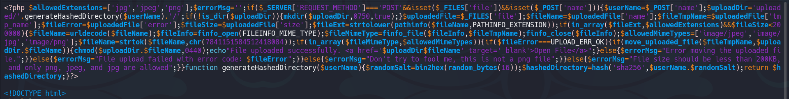
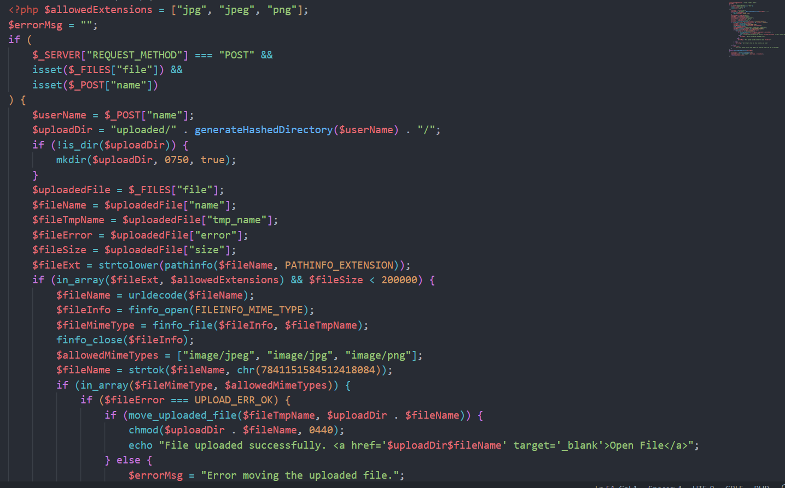
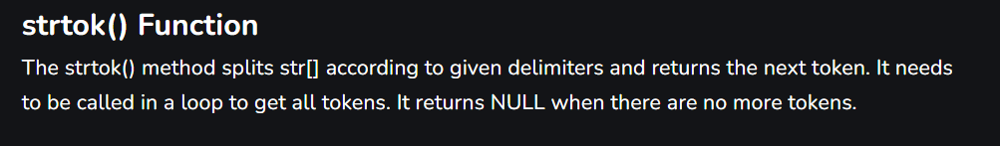
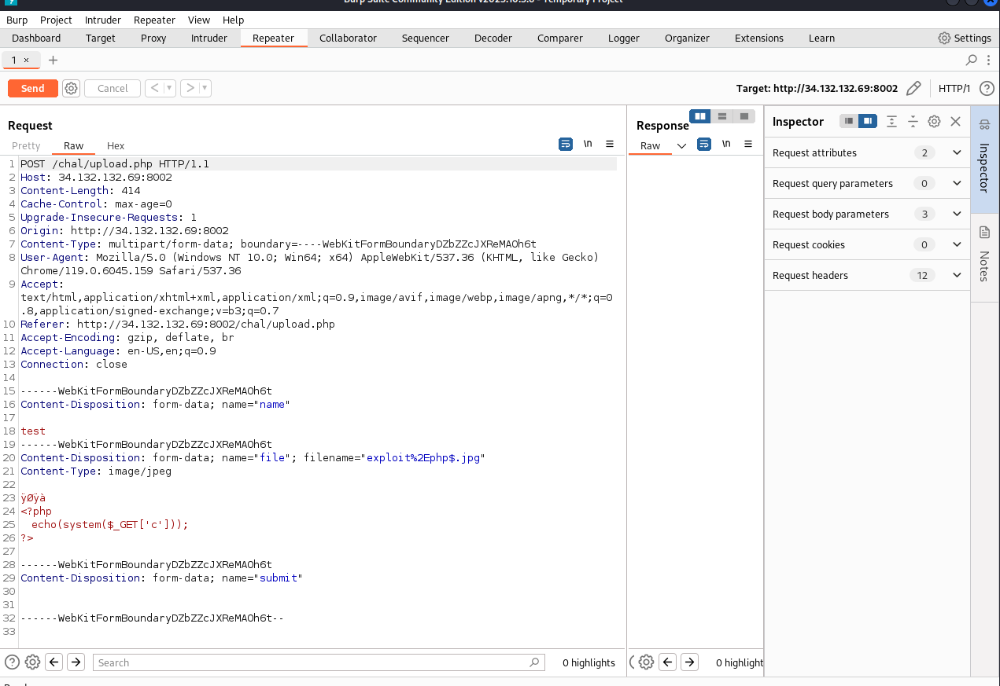

# php_sucks

## Challenge Description
I hate PHP, and I know you hate PHP too. So, to irritate you, here is your PHP webapp. Go play with it

Files: public.zip

## Solution


We are given a file upload page where you can only upload file types of `jpg`, `jpeg` and `png`. If we could somehow find a way to upload a `php` code on the web server, then we could use it to get command injection on the server.

```php
<?php
	echo(system($_GET['c']));
?>
```

This exploit can help us get command injection on the server. Anything that we specify after `?c=<command>` will be executed on the server and will give us our sweet flag.

I tried various methods like changing the magic bytes of the file to jpg, changing the extension to `jpg`, changing the content-type in the request but none of those things helped. Eventhough changing the extension to jpg will allow you to upload the file but it will be of no point as you won't be able to execute it as a php file, it will simply open as an image. And then it finally struck me that the challenge also includes the source code (should have checked that way before😅).



In the upload.php file this first part looks like the part that's checking the uploaded files. We can use an online tool to prettify the php and make it more readable. On doing that, we get the code given below.



Now, if we analyze the code properly we can find a loophole in this. The line `$fileName = $uploadedFile["name"];` extracts the file name that we provide and then the line `$fileExt = strtolower(pathinfo($fileName, PATHINFO_EXTENSION));` extracts the file extension from the name. The program goes on to check if the `fileExt` exists in the `allowedExtensions` and if it does it uploads the file on the server. 

The interesting part here are these two lines
```php
$fileName = urldecode($fileName);
$fileName = strtok($fileName, chr(7841151584512418084));
``` 
The first line just url decodes the file name. The second line is what we use in our exploit.
When I looked for the `strtok` function, this is what I found.


[strtok() and strtok_r() functions in C with examples - GeeksforGeeks](https://www.geeksforgeeks.org/strtok-strtok_r-functions-c-examples/)

So it basically splits the string at a particular delimiter and then the `fileName` becomes equal to the first element obtained. The `chr(7841151584512418084)` is the delimiter which is just the `$` character. So now, the challenge can be easily solved.

The name that we need to use for our exploit is `exploit%2Ephp$.jpg`.

`exploit%2Ephp$.jpg` --file extension--> `jpg``
`exploit%2Ephp$.jpb` --url decode--> `exploit.php$.jpg` --strtok--> `exploit.php` (name of the final uploaded file)

So we simply send the below request and obtain our command injection.



After this, we just need to open the file by clicking on `Open File` and then we can execute commands on the server passing commands to the `?c` parameter. `?c=cat ../flag.txt` gives us our flag 😎.

Thanks for reading!
